# Welcome to my SHOP SHOP using REDUX!

## Description

#### This SHOP SHOP is an e-commerce platform that uses REDUX to manage global state (instead of React's Context API) with STRIPE integration.

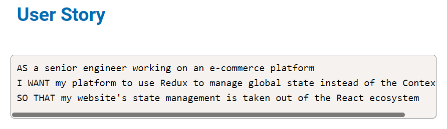

## Table of Contents
* [Installation](#installation)
* [Usage](#usage)
* [Deployment](#deployment)
* [License](#license)
* [Contributor](#contributor)

## Installation
In order to install this repository, you will need to clone it and run npm init and npm install to install all of the dependencies listed inside the package.json file.

## Usage
To use this app after cloning and initializing the dependencies, run npm start in the terminal to start it in your local browser. This app has also been deployed through Heroku. See the Deployment section below for the link.

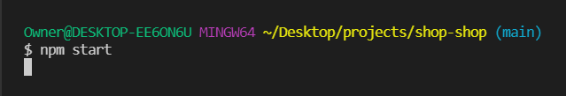

When the browser opens, you are greeted with the homepage.

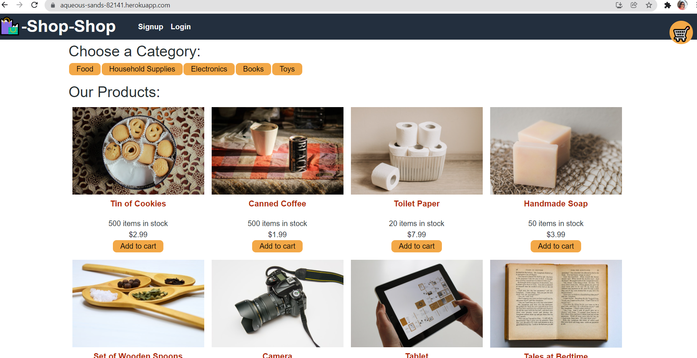

New users need to sign up to be able to order.

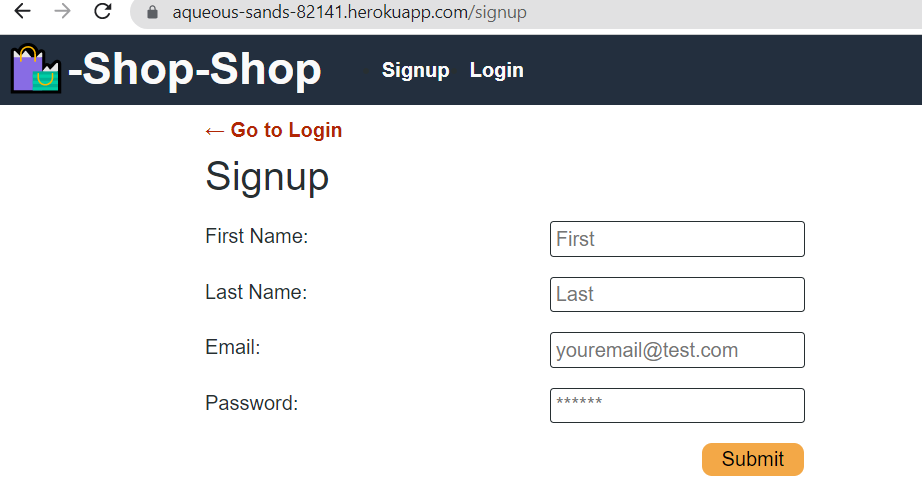

Returning users can login with their email and password.

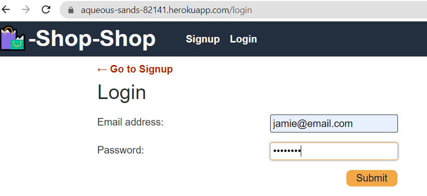

Once logged in, you can choose your items to add to the shopping cart.

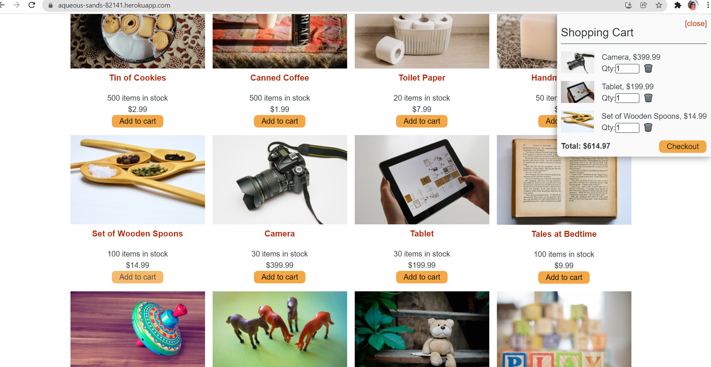

When you would like to checkout, you will be redirected to Stripe.

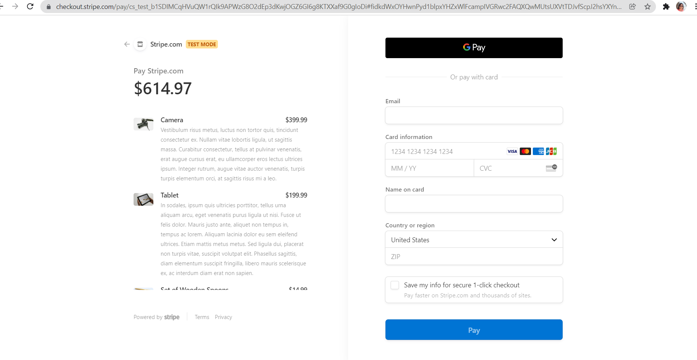

On the Stripe page, you can enter your credit card information (enter dummy text for testing).

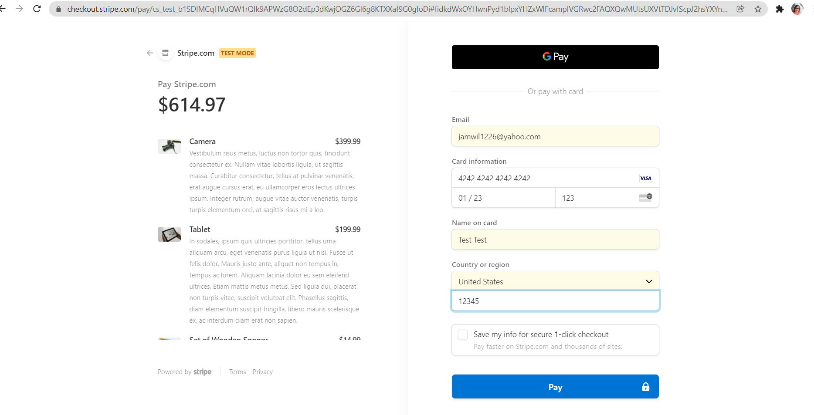

Once your credit card transaction is approved, you will be given a success message.

You can check your order history at any time.

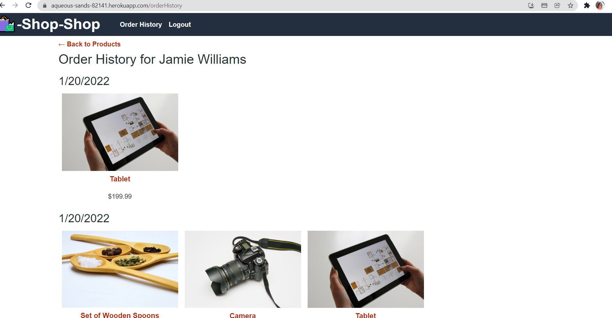

Your shopping cart returns to empty to be able to add more items.

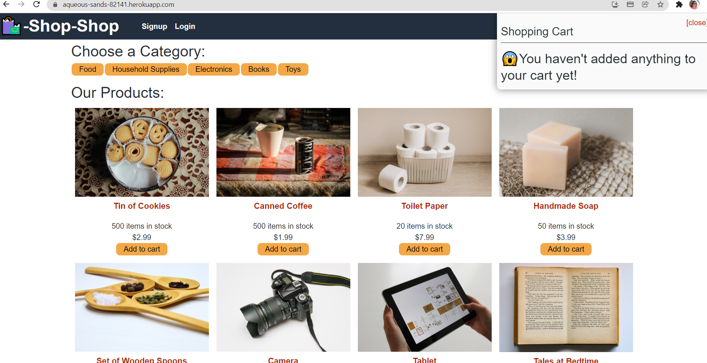

This app has been deployed through Heroku. See the link in the next section.

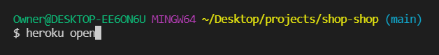

## Deployment
You can find this SHOP SHOP deployed in Heroku at https://aqueous-sands-82141.herokuapp.com/

### I hope you enjoy my SHOP SHOP using REDUX! I welcome all contributions and feedback!

## License
The license for this project is the MIT.

Copyright © 2021

## Contributor
*If you have any questions, please reach out to me.*

### _Jamie Williams_ 

Jamie's GitHub: [@jamwil1226](https://github.com/jamwil1226/)